# Spotify Python ETL

## Project Context and Goals 

This project aims to build a scalable ETL (Extract, Transform, Load) pipeline that ingests data from the Spotify API, transforms it into structured formats, and loads it into a PostgreSQL database hosted on AWS RDS.

The pipeline enables efficient data extraction and transformation of Spotify playlist data, including details on tracks, albums, and artists. It is designed to run on AWS using Docker containers and Amazon ECS (Elastic Container Service) for orchestration. Data is stored in RDS for future analysis.

The chosen playlist for this pipeline is the Lofi Girl's Favorite Playlist, a popular collection among individuals who enjoy relaxing, lo-fi music while working or studying. This playlist provides an interesting dataset for analysis due to its relevance to productivity and study culture.

## Business Objective 

The primary objective of this pipeline is to provide structured and detailed insights into Spotify playlist and artist data. These insights can be leveraged for the following purposes:

- Understanding track and album performance
- Identifying the popularity of artists and genres
- Tracking trends in song releases over time

The insights are valuable for Spotify data analysts, music marketers, and playlist curators who want to analyze and optimize engagement with playlists.

## Consumers 

The main consumers of the ETL pipeline and its outputs are:

- **Spotify Analysts:** To gain insights into track, album, and artist popularity.
- **Music Marketers:** To identify trending artists, songs, and genres.
- **Playlist Curators:** To inform the curation and inclusion of trending tracks in playlists.

## Business Questions 

The following SQL queries are designed to answer key business questions and provide insights for playlist optimization and audience engagement:

1. **Top 5 Most Popular Artists' Contribution**

    _Question:_ Who are the top 5 most popular artists, and what is their contribution to the playlist?

    > _Understanding the top-performing artists allows strategic decisions to feature these artists more prominently in playlists, marketing efforts, or collaborations._

2. **Most Popular Tracks with Duration**

    _Question:_ What are the most popular tracks along with their durations (in minutes)?

    > _Knowing the most popular tracks and their lengths helps tailor playlist creation to user preferences and optimize track order for increased engagement._

3. **Track Popularity Trend by Release Year and Month**

    _Question:_ How has track popularity trended over time by year and month of release?

    > _Analyzing popularity trends by release year and month provides insights into how audience preferences evolve, guiding decisions on content releases and promotions._

4. **Album-Track Popularity Comparison**

    _Question:_ How does the popularity of an album compare to its tracks?

    > _This comparison reveals whether specific tracks are outperforming or underperforming their album, providing deeper insights for featuring or marketing specific songs._

5. **Genre, Track, and Artist Details**

    _Question:_ What are the genre, track, and artist details for all the tracks in the playlist?

    > _This provides a complete view of the playlist's content, helping analyze the diversity and reach of various genres, tracks, and artists._

## Project Structure

```
etl_project/
│
├── assets/
│   ├── metadata_logging.py        # Handles logging of metadata to DB
│   ├── pipeline_logging.py        # General logging for the ETL pipeline
│   └── spotify.py                 # Contains extraction and transformation logic
│
├── connectors/
│   ├── postgresql.py              # PostgreSQL connection and queries
│   └── spotify.py                 # Spotify API client
│
├── logs/                          # Logs generated during the pipeline run
│
├── pipelines/
│   ├── spotify.py                 # The main pipeline file for running the ETL process
│   └── spotify.yaml               # YAML config file for the pipeline
│
└── sql/
    ├── album_track_popularity_comparison.sql
    ├── genre_track_and_artist_details.sql
    ├── most_popular_tracks_with_duration.sql
    ├── top_5_most_popular_artists_contribution.sql
    └── track_popularity_trend_by_release_year_month.sql

etl_project_tests/
│
├── assets/
│   └── test_spotify.py            # Unit tests for Spotify data transformations
│
├── connectors/
│   └── test_spotify.py            # Unit tests for Spotify API client
```


## Source Datasets 

The data is fetched directly from the **Spotify Web API** for the following entities: 

- **Tracks:** Information about individual tracks in the playlist (e.g., popularity, duration, album association).
- **Albums:** Details about the albums the tracks belong to (e.g., release date, total tracks).
- **Artists:** Details about the artists (e.g., genres, popularity).

## Solution Architecture  

The ETL pipeline is containerized and runs on AWS infrastructure (refer to screenshots in the _"Appendix - AWS and pgAdmin Screenshots"_ section below):

1. **Docker:** Used to containerize the Python application. The image is pushed to **Amazon ECR (Elastic Container Registry)**.
2. **Amazon ECS (Elastic Container Service):** Orchestrates and manages Docker containers in the ECS cluster.
3. **AWS S3:** Stores the `.env` file containing sensitive configurations such as RDS endpoint credentials and Spotify API secrets.
4. **AWS RDS (Relational Database Service):** Hosts the PostgreSQL database to store track, album, and artist data, SQL transformed views, as well as metadata for logging purposes.
5. **IAM Role:** Used by ECS to access the `.env` file from S3. The role allows ECS to assume the necessary permissions for accessing sensitive data securely.

## ELT and ETL Techniques Applied

This project uses a **combination of ETL and ELT** approaches. Light transformations are applied using **pandas** before loading data into the database (ETL), while more complex transformations and aggregations are performed using SQL within the database (ELT).

- **Extract:** Data is fetched from the Spotify API (tracks, albums, and artists) using the API client in the `spotify.py` module.
- **Transform (ETL):** Before loading, the data is lightly transformed using **pandas** to clean and normalize nested JSON structures, preparing it for relational storage.
- **Load (ELT):** The transformed data is then loaded into **PostgreSQL** using **SQLAlchemy**. The pipeline supports `insert`, `upsert`, and `overwrite` load methods.
- **Transform (ELT):** After the data is loaded, SQL-based transformations and aggregations are performed within PostgreSQL to generate insights, such as creating views to answer key business questions.

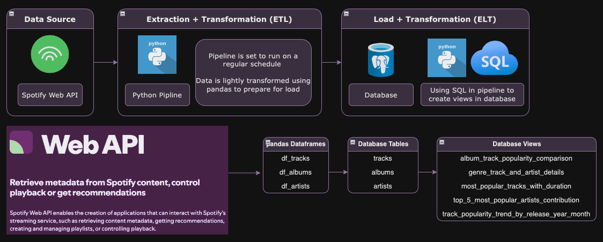

### ERD (Entity Relationship Diagram)

The ERD for this project outlines the relationships between the `tracks`, `albums`, and `artists` tables:

- `Tracks`: Holds detailed information about individual tracks, including the track's ID, name, popularity, duration, and associated album and artist.
- `Albums`: Stores metadata about albums, such as album ID, name, release date, and total number of tracks.
- `Artists`: Contains details about artists, including artist ID, name, genres, and popularity.

The relationships are:

- One-to-many relationship between albums and tracks.
- One-to-many relationship between artists and tracks.

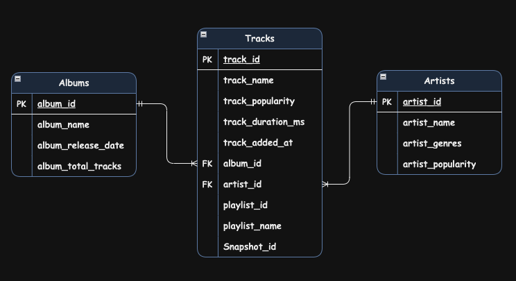

## Installation and Running Instructions

### Prerequisites

1. Install **Docker** and ensure it's running on your system.
2. Set up **AWS CLI** with appropriate credentials to access your ECR, ECS, and RDS instances.
3. Create a **Spotify Developer Account** and obtain your `client_id` and `client_secret` for accessing the Spotify API.
4. Set up a **PostgreSQL RDS instance** on AWS RDS for data storage.
5. Store your **environment variables** (Spotify API credentials, RDS credentials, etc.) in an S3 bucket for secure access by ECS.

### Instructions

1. **Clone the Repository**

    ```bash
    git clone <this-repository-url>
    cd dec_spotify_python_etl/app
    ```

2. **Build, Tag, and Push the Docker Image to AWS ECR**

    Use AWS CLI commands to build and push the Docker image to ECR.

    _The commands usually can be found by clicking on the `View push commands` button on AWS ECR once a private repository gets created_ (Documentation: [Pushing a Docker image to an Amazon ECR private repository](https://docs.aws.amazon.com/AmazonECR/latest/userguide/docker-push-ecr-image.html))

3. **Create and Configure the ECS Cluster**

    - Create a new ECS cluster via the AWS console (e.g., `spotify_etl_cluster`)
    - Define a new Task Definition (e.g., `spotify_etl`) that uses the Docker image (e.g., `spotify_etl`) you pushed to ECR
    - Ensure the task definition uses the appropriate IAM Role (`SpotifyETLRole`) that has permissions to access the `.env` file stored in S3

4. **Run the Task in ECS** 

    - Start the task within the ECS cluster and monitor the logs to ensure that the ETL process is running correctly and data is being loaded into RDS.

5. **Verify Data Load in PostgreSQL**

    - Use a tool like **pgAdmin** or any SQL client to connect to the RDS instance and verify that the `tracks`, `albums`, and `artists` tables have been populated with data.

## Limitations and Lessons Learned

### Limitations

During the development of the Spotify ETL pipeline, several key limitations and lessons were identified:

1. **Incremental Extract**

    - Spotify’s API does not provide an `updated_at` timestamp or similar metadata for incremental extracts. Therefore, each run of the pipeline currently pulls all the data. Implementing a more sophisticated incremental extraction based on other attributes or metrics (which I'm still learning) could be a future improvement.

2. **Snapshot Optimization**

    - Although I ingested the playlist-level `snapshot_id` field, the ETL process currently does not utilize the `snapshot_id` to determine if the playlist has been updated. Ideally, by checking the `snapshot_id`, we could skip running the ETL if the playlist data hasn’t changed, optimizing the pipeline performance.

3. **Data Volume**

    - The dataset in this project is relatively small, so chunking techniques for handling larger datasets were not implemented. If the data volume increases, chunking can be introduced to process large datasets in memory efficiently.

4. **DAG and Orchestration**

    - While the pipeline runs as a single process, more advanced data pipelines often rely on Directed Acyclic Graphs (DAGs) for task orchestration. Tools like `dbt` and `Airflow`/`Dagster` can be introduced later to manage complex workflows where certain tasks depend on the output of others.

### Lessons Learned

**Pagination Handling:** Spotify’s API paginates large datasets, limiting responses to 100 items per request. Understanding and implementing pagination was crucial for retrieving the entire playlist, as my initial pipeline only fetched 100 out of 197 tracks. By checking the `next` field in the API response and continuing to fetch additional pages, I was able to collect all data points.

## Appendix

### AWS and pgAdmin Screenshots

#### AWS ECR

* ECR Repository

    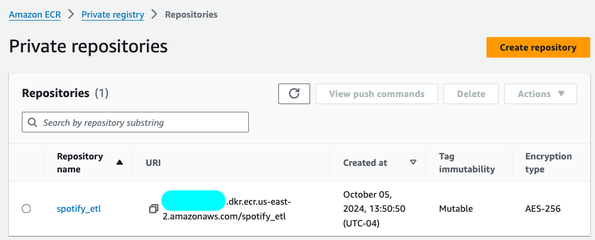

* Docker Image in ECR Repo

    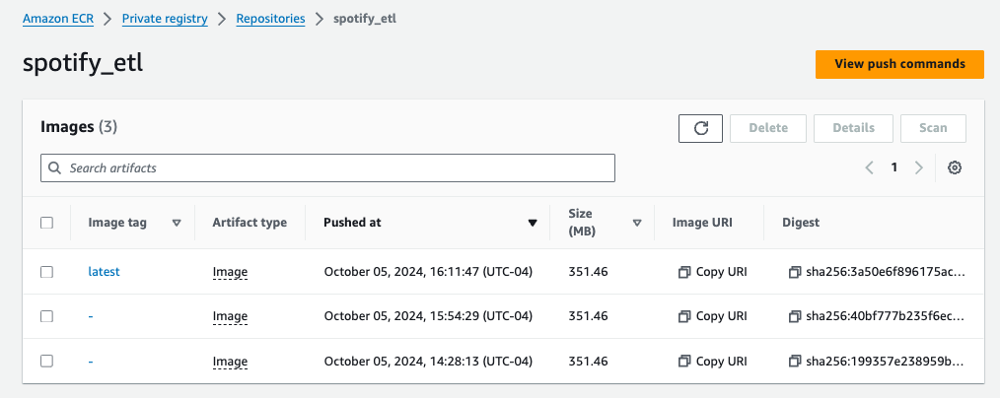

#### AWS ECS

* ECS Cluster

    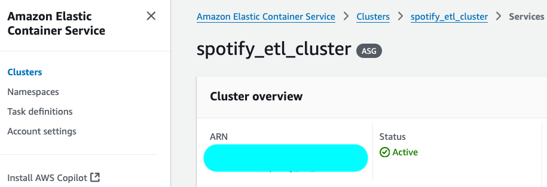

* ECS Task Definitions

    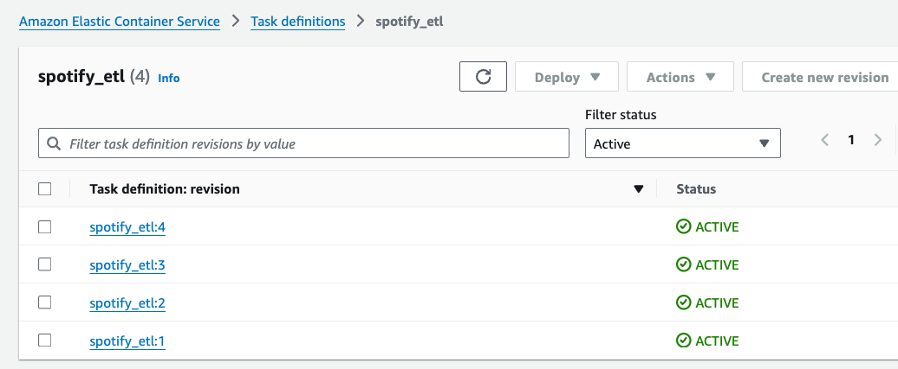

### AWS S3

* `.env` file in **S3** which is used in the task definition that runs the pipeline in ECS

    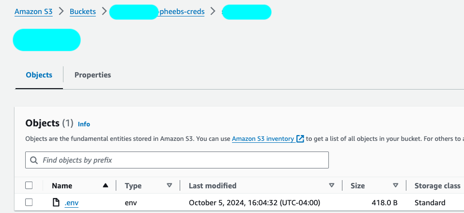

### AWS IAM

* **IAM Role** used to allow ECS tasks to access environment variables from S3

    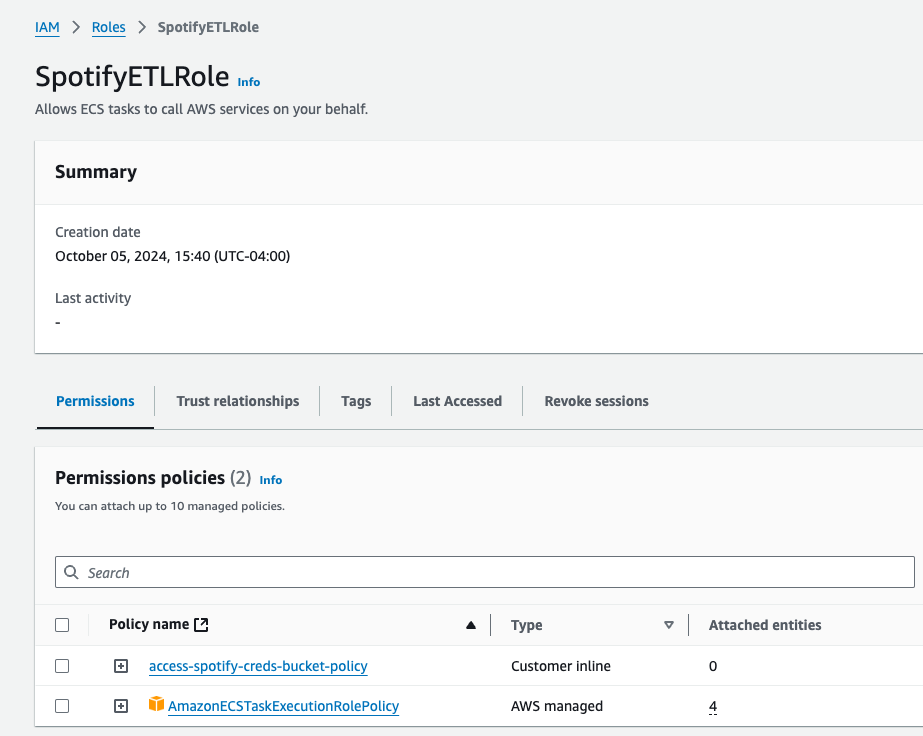

### AWS RDS

* **RDS Database** created for storing track, album, and artist data, along with metadata for logging

    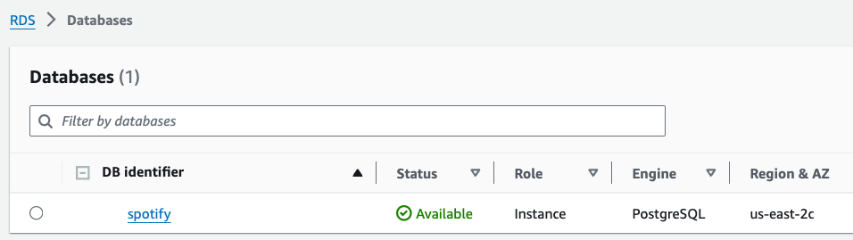

### AWS CloudWatch

* **Logs** showing successful pipeline execution and monitoring

    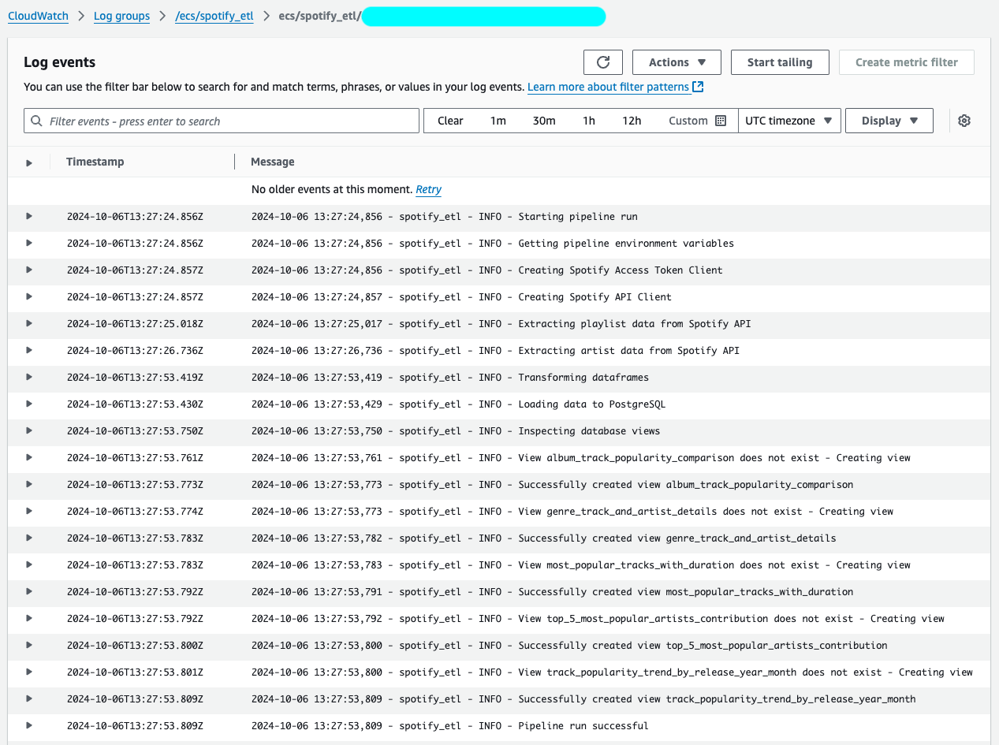

### Postgres `logging` DB

* **Logs** queried from pgAdmin4 to verify logging activity

    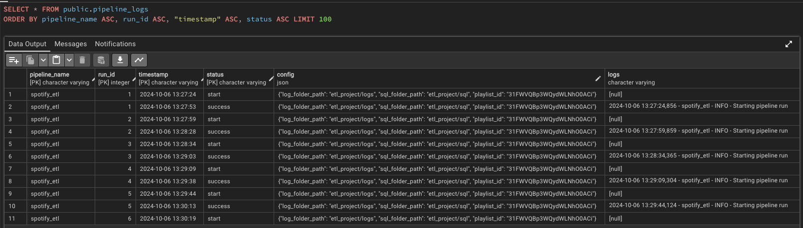

    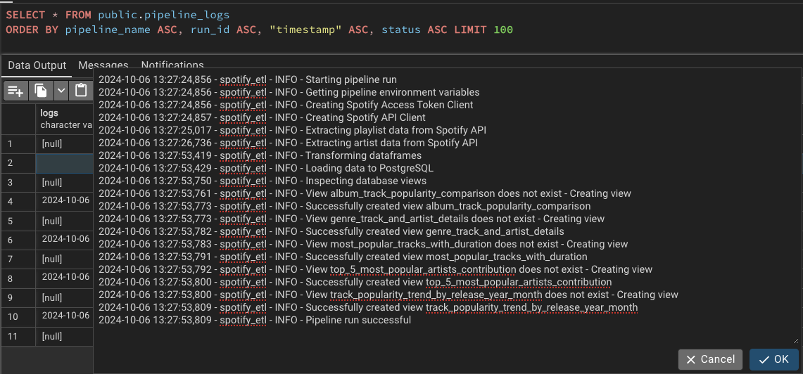

### Postgres `spotify` data DB

* **Tables and Views** successfully written into the database, confirming the pipeline execution

    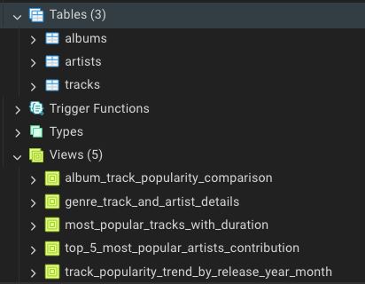

### Run Pipeline Locally

This pipeline can also be executed locally without using Docker or AWS services. To do this, you need to have a local PostgreSQL server configured.

1. Navigate into the `app` directory:

    ```bash
    cd app
    ```

2. Run the pipeline: 

    ```bash
    python -m etl_project.pipelines.spotify
    ```

Refer to the logs in the terminal, as shown below:

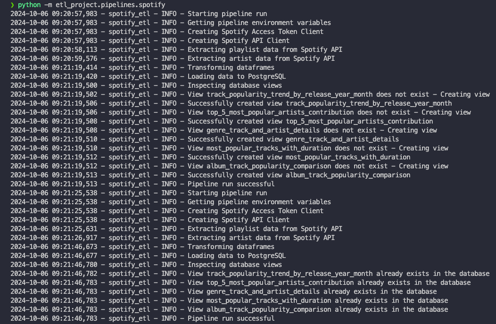

### Data Source Selection Note 

As part of the data source selection process, we were given several options, such as Public APIs, Kaggle datasets, and sample Postgres databases. I chose to work with the Spotify API because:

1. **Familiarity with SQL:** I already have experience with SQL and relational databases, so I wanted to practice more on API extraction.
2. **Learning Opportunity:** The Spotify API provides an excellent real-time dataset, allowing me to enhance my Python scripting skills for API-based data extraction.
3. **Ease of Use:** Spotify’s API documentation is well-organized, making it easy to navigate and extract data efficiently. You can find more information in the [Spotify for Developers Documentation](https://developer.spotify.com/documentation/web-api)
